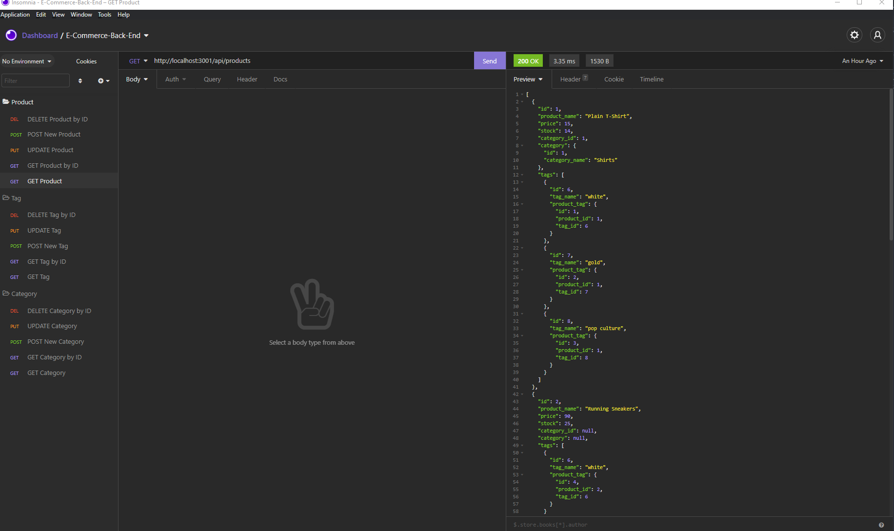

# E-Commerce-Backend

## Description
This is a command line tool to create a new E-Commerce-Backend project. It implements sequelize and express to manage the database and the server. It also implements the authentication and authorization. It also implements the routes for the different pages. I was able to successfully learn sequelize due to the nature of the project and have a good understanding of these tools because of the experience.

## Table of Contents 
- [Installation](#installation)
- [Usage](#usage)
- [License](#license)
- [Contributing](#contributing)
- [Tests](#tests)
- [Questions](#questions)

## Installation
You can install this project here: https://github.com/henlowgg/e-commerce-backend

## Usage
To use this application, you will need to install it and then run the following commands:
npm install

You will also need to install the following dependencies:
npm install inquirer
npm install mysql
npm install table

After installing the dependencies, you will need to run an instance of sql and build the database with the following command:
source db/schema.sql

Then quit the sql instance and run the following command to start the server:
npm run seed

Then run the following command to start the server:
nodemon server.js

After these steps are completed, you will be able to test all of the CRUD operations.

Please find a walkthrough video of the application here: 
https://watch.screencastify.com/v/Eu7pLD8ndpDKvUUjJZ8C

or here:
https://www.youtube.com/watch?v=TXYte5UWfwg

## License
This project is covered by a MIT license.

## Credits
I would like to thank Leif for instructions through videos in class, and my whole classmates as well for the help always, especially Rebecca Dong and Andrew for helping me grasp the understanding of the project and how to successfully implement it.

## Contributing
If you want to make contributions, please refer to the following instructions:

If you'd like to make a contribution to this project, please reach out using the contact information in the Questions section of this README.

## Tests
If you'd like to test this project, please reach out using the contact informnation in the Questions section of this README. 

## Questions
If you have any questions you can reach me here:

Github Profile - henlowgg

Github Profile Link - https://github.com/henlowgg

Email - henlowgg@outlook.com
